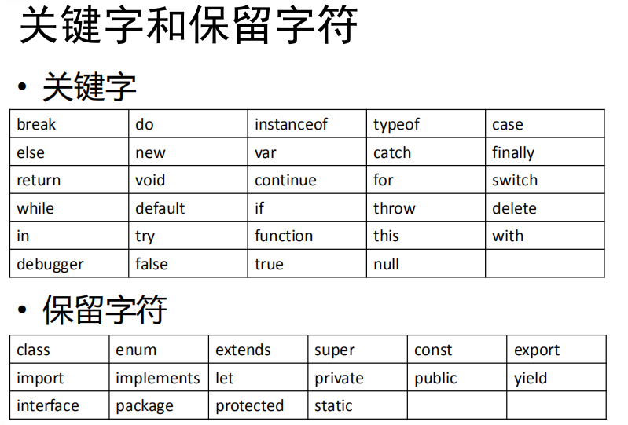
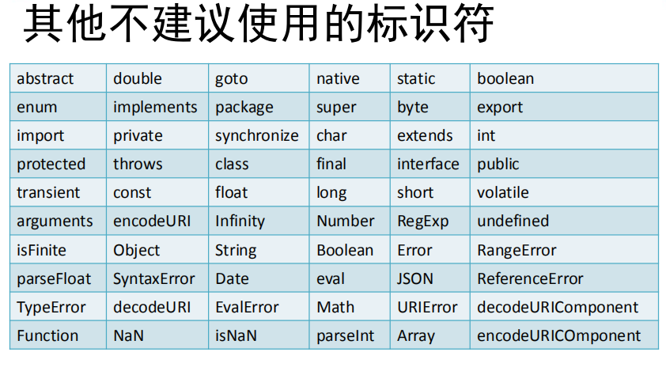

# 尚硅谷最新版JavaScript基础全套教程完整版

## 1.JS简介

### 1.1 起源

- **诞生于**：1995年

- **作用**：处理网页中的前端验证

- **前端验证**：检查用户输入内容是否符合一定的规则（如：用户名的长度、密码的长度、邮箱的格式等）

- **发明公司**：网景公司（Netscape）Navigator浏览器    初始名：LiveScript

- Sun公司介入  改名为：JavaScript

- 微软   explorer IE1.0  JScript

- **标准命名**：ECMAScript （网景公司开源后欧洲计算机协会定义）

  

### 1.2 实现


- Navigator->FireFox

- v8最快


**完整的JavaScript包含**：ECMAScript、DOM、BOM


### 1.3 特点

- 解释型语言
- 类似于C和Java的语法结构
- 动态语言
- 基于原型的面向对象


## 2.Helloworld

```html
<!DOCTYPE html>
<html lang="en">
<head>
    <meta charset="UTF-8">
    <meta name="viewport" content="width=device-width, initial-scale=1.0">
    <title>HelloWorld</title>

    <!-- JS代码需要写到script标签中 -->
    <script type="text/javascript">       
        /* 
         *   控制浏览器弹出一个警告框
         *   alert("我是一个警告框哈");
         */
         
        /* 
         *   让计算机在页面输出一个内容
         *   document.write("向body中写内容呀");
         */

        /* 
         *   向控制台输出一个内容
         *   console.log("在控制台这里输出啊");
         */  
        
        alert("HelloWorld!");
        document.write("HelloWorld~");
        console.log("HelloWorld。");

    </script>
</head>
<body>
    
</body>
</html>
```

**输出语句**：

- alert("HelloWorld!");		弹出警告框
- document.write("HelloWorld~");       文本中写内容
- console.log("HelloWorld。");         控制台输出


## 3.编写位置

```html
<!DOCTYPE html>
<html lang="en">
<head>
    <meta charset="UTF-8">
    <meta name="viewport" content="width=device-width, initial-scale=1.0">
    <title>编写位置</title>

    <!-- 可以将js代码编写到外部js文件中，然后通过script标签引入 
         写到外部文件中可以在不同的页面中同时引用，也可以利用到浏览器的缓存机制，推荐使用方式 -->
    <script type="text/javascript" src="js/script.js"></script>

    <!-- script标签一旦用于引入外部文件了，就不能再编写代码了，即使编写了浏览器也会忽略 
        如果需要则可以再创建一个新的script标签用于编写内部代码 
        js代码是按照从上到下的顺序一行一行执行
    -->

    <!--  可以将js代码编写到script标签  -->
    <script>
        alert("我是script标签中的代码");
    </script>
    
</head>

<body>
    <!-- 虽然可以写在标签的属性中，但是他们属于结构与行为耦合，不方便维护，不推荐使用 -->

    <!-- 可以将js代码编写到标签的onclick属性中  当我们点击按钮时，js代码才会执行 -->
    <button onclick="alert('点个锤子点')">别点我！</button>

    <!-- 可以将js代码写在超链接的href属性中，这样当点击超链接时，会执行js代码 -->
    <a href="javascript:alert('让你点你就点')">点我一下</a>

    <!-- 希望超链接点完以后没有任何反应 通过js处理一些功能-->
    <a href="javascript:;">点我一下</a>


</body>
</html>
```


|      编写位置       |                             说明                             | 推荐与否                                                     |
| :-----------------: | :----------------------------------------------------------: | ------------------------------------------------------------ |
| 标签的onclick属性中 |               当我们点击按钮时，js代码才会执行               | 不推荐，结构与行为耦合，不方便维护                           |
| 超链接的href属性中  |                  点击超链接时，会执行js代码                  | 不推荐，结构与行为耦合，不方便维护                           |
|    script标签中     |                          可以有多个                          | 推荐                                                         |
|    外部js文件中     | 需要通过script标签引入  type="text/javascript" src="js/script.js" | 推荐，写到外部文件中可以在不同的页面中同时引用，也可以利用到浏览器的缓存机制 |


**script标签一旦用于引入外部文件了，就不能再编写代码了，即使编写了浏览器也会忽略，如果需要则可以再创建一个新的script标签用于编写内部代码**

**js代码是按照从上到下的顺序一行一行执行**


## 4.基本语法

```html
<script type="text/javascript">
        /* 
            js注释，多行注释，注释中内容不会被执行，但是可以再源代码中查看
            要养成良好的编写注释的习惯，也可以通过注释来对代码进行一些简单的调试
        */
        
        //  单行注释  只对它后面的内容起作用 

        /*
         *  1.js中严格区分大小写
         *  2.js中每一条语句以“;”结尾 （土豆土豆我是地瓜，over）
         *    如果不写分号，浏览器会自动添加分号，但是会消耗一些系统资源。
         *    而且有时候，浏览器会加错分号，所以在开发中分号必须写
         *  3.js中会忽略多个空格和换行，所以我们可以利用空格和换行对代码进行格式化，格式化是为了好看
         *
         */

</script>
```


## 5.字面量和变量

```html
<script type="text/javascript">
        /*
         *  字面量，都是一些不可变的值
         *  比如1，2，3，4，5（1不能变成2，不然太可怕了）
         *  字面量都是可以直接使用，但是我们一般都不会直接使用字面量
         *
         *  变量，变量可以用来保存字面量，而且变量的值可以任意改变
         *  变量更加方便我们使用，所以再开发中都是通过变量去保存字面量，而且很少直接使用字面量
         *  还可以通过变量对字面量进行描述
         */
    
        
        //声明变量，在js中使用var关键字来声明一个变量
        var a;

        //为变量赋值
        a = 123;
        a = 456;

        //声明和赋值同时进行
        var b = 789;
        //通过变量对字面量进行描述
        var age = 18;
        
        //输出变量
        console.log(a);
        console.log(b);

</script>
```


## 6.标识符

```html
<script type="text/javascript">
        /*
         *  标识符
         *     -在js中所有的可以由自主命名的都可以称为是标识符
         *     -例如：变量名，函数名，属性名都属于标识符
         *     -命名一个标识符需要遵守以下的规则：
         *         1.标识符中可以含字母、数字、_、$
         *         2.标识符不能以数字开头
         *         3.标识符不能是ES中的关键字和保留字（皇上叫张三，其他所有人都不能叫张三）
         *         4.标识符一般都采用驼峰命名法
         *              -首字母小写，每个单词的开头字母大写，其余字母小写
         *                  hellomyworld -> helloMyWorld
         *                  HeLomYWOrlD 可以但没必要
         *     -js底层保存标识符实际上是采用Unicode编码
         *      所以理论上讲，所有utf-8中含有的内容都可以作为标识符
         *
         */
        
        //var a_@_# = 123;  报错
        //var 1ab_c = 123;  报错
        //var var = 123;    报错

        var a_1_$_ = 123;

        var 锄禾日当午 = 456;//能用，但不要这么用

        console.log(a_1_$_);
        console.log(锄禾日当午);
    
</script>
```








## 7.字符串

```html
<script type="text/javascript">

        /*
         *  数据类型指的就是字面量的类型
         *  在js中一共有六种数据类型
         *      String 字符串
         *      Number 数值
         *      Boolean 布尔值
         *      Null 空值
         *      Undefined 未定义
         *      Object 对象
         *  其中String Number Boolean Null Undefined属于基本数据类型
         *  而Object属于引用数据类型
         *
         */

        /*
         *  String字符串
         *  -在js中字符串需要用引号引起来
         *  -使用双引号和单引号都可以，但是不要混着用
         *  -引号不能嵌套，双引号不能放双引号，单引号不能放单引号
         *
         */
        var str = "hello";
        console.log(str);

        /*
         *  在字符串中我们可以使用\作为转义字符
         *  当表示一些特殊符号时可以使用\进行转义
         *  \"   表示"
         *  \'   表示'
         *  \n   表示换行
         *  \t   制表符
         *  \\   表示\
         *  \\\\ 表示\\
         *
         */

        str = "我说：\"今晚\t天气\n不错\"";
        str = "\\";


</script>
```


## 8.Number

```html
<script type="text/javascript">
        /*
         *  在js中所有的数值都是Number类型
         *  包括整数和浮点数（小数）
         *
         *  js中可以表示的数字的最大值Number.MAX_VALUE
         *  Number.MAX_VALUE = 1.7976931348623157e+308
         *  如果使用Number表示的数字超过了最大值，则会返回一个Infinity正无穷
         *  Infinity  正无穷
         *  -Infinity 负无穷
         *  使用typeof检查Infinity也会返回Number
         *
         *  大于0的最小值Number.MIN_VALUE
         *  Number.MIN_VALUE=5e-324
         *
         *  NaN是一个特殊的数字，表示Not a Number
         *  使用typeof检查NaN也会返回Number
         *
         *  在js中整数的运算基本可以保证精确
         *  如果使用js进行浮点数，可能得到一个不精确的结果
         *  所以千万不要使用js进行精确度要求比较高的运算
         */
        var a = 123;
        a = 45.678;
        
        var b = 123;
        var c = "123";

        console.log(b);
        console.log(c);

        var d = 123456789 + 987654321;
        var e = 0.1 + 0.2;

        console.log(d);
        console.log(e);

        /*
         * 可以使用一个运算符typeof来检查一个变量类型 
         *  语法：typeof 变量
         *  检查字符串时，会返回string
         *  检查数值时会返回number
         */

        console.log(typeof b);
        console.log(typeof c);
        console.log(Number.MAX_VALUE);

</script>
```


## 9.布尔值

```html
<script type="text/javascript">
        /*
         *  Boolean 布尔值
         *  布尔值只有两个，主要用来做逻辑判断
         *  true  真
         *  false 假
         *
         */
        
        var bool = true;
        console.log(bool);
        console.log(typeof bool);

</script>
```


## 10.Null和Undefined

```html
<script type="text/javascript">
    /*
     *  Null
     *  Null类型的值只有一个，就是null
     *  null这个值专门用来表示一个为空的对象
     *  使用typeof检查一个null值时，会返回object
     *
     *  Undefined
     *  Undefined类型的值只有一个，就是undefined
     *  当声明一个变量，但是不给变量赋值时，它的值就是undefined
     *  使用typeof检查一个undefined时也会返回undefined
     *
     */
    
    var a = null;
    console.log(a);
    console.log(typeof a);

    var b;
    console.log(b);
    console.log(typeof b);
    
    </script>
```

