# QQ音乐总结

## 一、布局

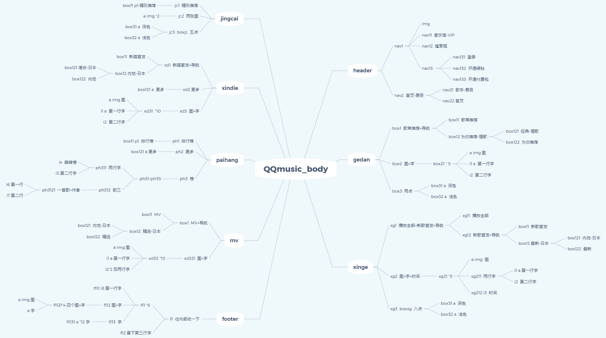

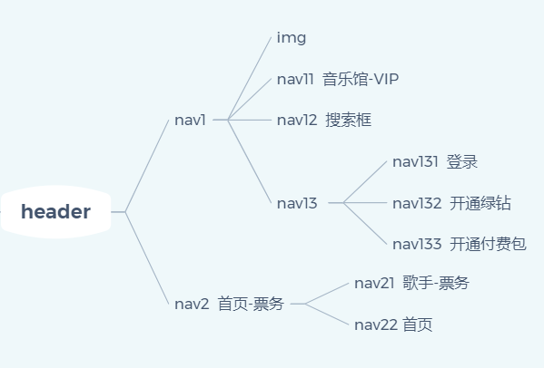

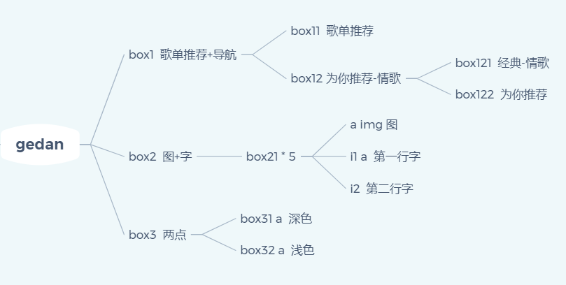

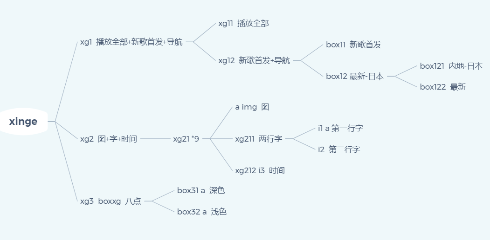

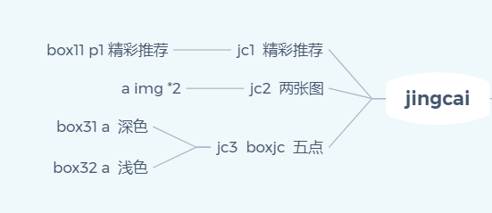

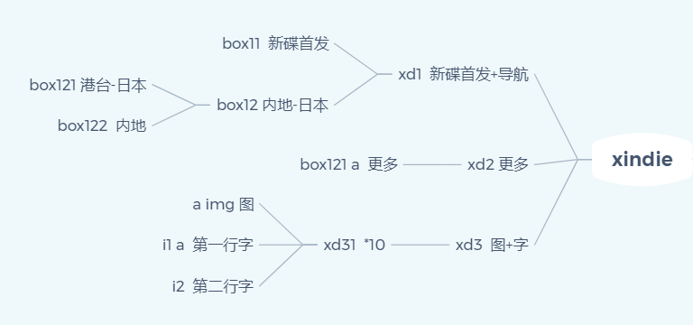

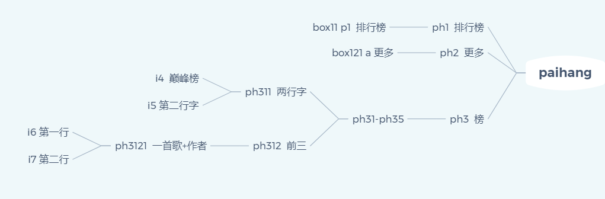

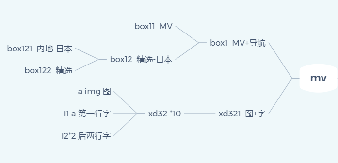

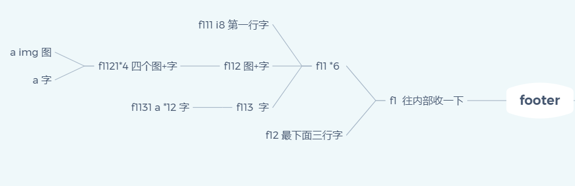

## 二、细节

### 1.head

##### (1)title 标题

<title>QQ音乐-千万正版音乐海量无损曲库新歌热歌天天畅听的高品质音乐平台！</title>

##### (2)css引入

<link rel="stylesheet" type="text/css" href="./style/basic.css"/>

##### (3)改图标

<link rel="short icon" href="./img/title.ico"></link>

图片一定是.ico格式

### 2.body

##### (1)横线

border-bottom: 1px solid rgb(240, 240, 240);

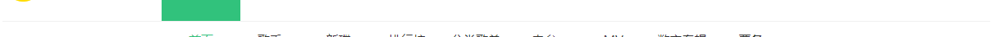

##### (2)渐变背景

background:url(/img/bj.png);

bj.png:

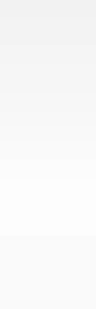

##### (3)flex布局

.xg2{

  display: flex;

  height: 300px;

  flex-wrap: wrap;

}

.xg21{

  height: 87px;

  width: 400px;

  border-bottom: 1px solid rgb(240, 240, 240);

}

<div class="xg2">
    <div class="xg21">

    

    

    

    

    

    

    

    

##### (4)小圆圈

（暂时）

.box31{

  background: rgb(175,175,175);

  border-radius: 100px;

  height: 8px;

  width: 8px;

  cursor: pointer;

}

.box32{

  background: rgb(225,225,225);

  border-radius: 100px;

  height: 8px;

  width: 8px;

  cursor: pointer;

  margin-left: 23px;

}

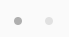

##### (5)导航

<div class="box12">
                <div class="box122">
                    <a href="">为你推荐</a>
                

                <div class="box121">
                    <a href="">经典</a>
                

                <div class="box121">
                    <a href="">轻音乐</a>
                

                <div class="box121">
                    <a href="">九月推荐</a>
                

                <div class="box121">
                    <a href="">官方歌单</a>
                

                <div class="box121">
                    <a href="">情歌</a>
                

            

.box121{

  flex:1;

  text-align: center;

}

 .box121 a{

  color: #333;

  text-decoration: none;

}

.box121 a:hover{

  text-decoration: none;

  color: #31c27c;

}

.box122{

  flex:1;

  text-align: center;

}

 .box122 a{

  color: #31c27c;

  text-decoration: none;

}

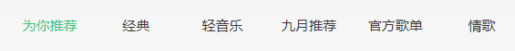

##### (6)悬浮标志

<div class="xf">
    

.xf{

  position: fixed;

  right: 45px;

  top: 165px;

}

