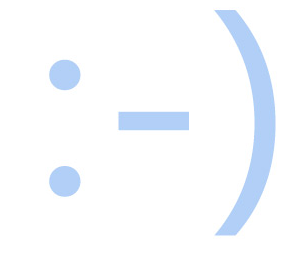

# QQlogin总结

## 一.思想

分块进行布局，可以三块也可四块。css进行布局字体等控制，html直接用css中定义的写内容。


## 二.get√

### 技巧

先把每块背景全部设置为深色，方便看清所在区域，直到最后再改回正常颜色。background。

### 关于！

在vs中输入"!"，会直接出来框架

### border

border:0.5px solid #d6dfea; 边框的大小，实心和颜色

border-radius:3%; 边框的角设置成圆弧

### cursor

cursor:auto 光标为竖线

cursor:default 光标为鼠标

cursor:pointer 光标为小手

cursor:wait 光标为转圈圈

还有很多其他的用的时候再查，挺好玩的

### display

css中的display是设置元来素显示的方式,block是一块状元素源的方式显示，inline是以内联元素的方式显示，none是不不显示；块状元素会单独占据一样，其他元素跟他在同一行的会被迫zd换行，挤到下一行那里去，inline则不会这样。

### text-decoration

```
.header t a{
        color:#1d5494df; 
        text-decoration: none;
   }
.header t a:hover{
       text-decoration: underline;
   }
```

平时没有下划线，鼠标放上去会有下划线

### input

- 文本域(type="text")
- 密码字段(type="password")
- 单选按钮(type="radio")
- 复选框(type=" checkbox")
- 提交按钮(type="submit")

```
<input  type="text" placeholder="" >

<input type="password" placeholder="" class="">

<input type="checkbox" class="" >

<input type="submit" value="" class="">
```


### float

float:left

float:right


## 三.基础

### height

### width

### margin

margin-left

margin-top

margin-bottom

margin-right

### font

font-size 字体大小

font-family 字体类型

### letter-spacing: 0.5px;

字体间间距，控制两个字之间的距离宽窄。

### *{ padding:0; margin:0; }

格式化页面
*表示所有元素

### <a href= >链接

### 图片


## 四.代码

```html
<!DOCTYPE html>

<html lang="en">

<head>

<meta charset="utf-8">

<title>QQright</title>

<style type="text/css">

  *{

    padding:0;

    margin:0;

  }

  .header{

    height:65px;

    width:100%;

    background:#eff4fa;

    border-bottom:1px solid #d6dfea;

  }

  .header img{

    height:55px;

    width:190px;

    margin-left:30px;

    margin-top:5px;

    vertical-align:middle;

    display:inline-block;

    float:none;

  }

  .header t{

    text-align:right;

    margin-left:75%;

    letter-spacing: 0.5px;

    font-size:12px;

    color:#959393a9;

  }

  .header t a{

    color:#1d5494df; 

    text-decoration: none;

  }

  .header t a:hover{

    text-decoration: underline;

  }


  .left{

    margin-top: 100px;

    margin-left: 500px;

    float: left;

    width:500px;

  }

  .left h1{

    font-size: 25px;

    color:rgb(104, 141, 189);

    font-family:"等线";

  }

  .left p{

    font-size: 14px;

    font-family: "微软雅黑";

    color: black;

  }

  .left span{

    font-size: 12px;

    color:rgb(106, 145, 195);

  }

  .left img{

    height:270px;

    width:270px;

    display: block;

    float: right;

    margin-right: 20px;

    margin-bottom: 50px;

  }

  .right{

    margin-top: 85px;

    margin-right: 530px;

    width:330px;

    height: 400px;

    float:right;

    border:0.5px solid #d6dfea;

    border-radius:3%;

  }


  .right t1{

    font-size: 17px;

    float:left;

    margin-top:10px;

    margin-left:45px;

    cursor: pointer;

    color:#b4b6b8;

  }

  .right t2{

    font-size: 17px;

    float:right;

    margin-top:10px;

    margin-right:45px;

    cursor: pointer;

  }

  .right .t3{

    font-size: 13px;

    font-family: "微软雅黑";

    color:rgba(231, 17, 17, 0.835);

    margin-top:42px;

    margin-left:20px;

    width:280px;

    height:35px;

  }

  .right .t4{

    float:left;

    margin-top:24px;

    margin-left:30px;

    width:20px;

    height:20px;

    cursor: pointer;

    border:1px solid black;

    background:white;

  }

  .right .t5{

    font-size: 20px;

    font-family: "黑体";

    background:rgba(79, 133, 219, 0.883);

    color:white;

    margin-top:30px;

    margin-left:23px;

    width:280px;

    height:40px; 

  }

  .right t6{

    font-size: 13px;

    color:rgb(88, 127, 177);
      
    text-align: center;

    margin-left: 130px;

    text-decoration: none;

  }

  .right t6:hover{

    text-decoration: underline;

  }

  .right t7{

    font-size: 12px;

    color:rgb(88, 127, 177);

    float:right;

    text-decoration: none;

  }

  .right t7:hover{

    text-decoration: underline;

  }

  .footer{

    font-size: 12px;

    position: fixed;

    bottom:0;

    left:0;

    right:0;

    height:40px;

    line-height:40px;

    border-top:1px solid #d6dfea;

    background:#eff4fa;

    text-align: center;

    color:#868484;

    letter-spacing: 0.5px;

  }

  .footer a{

    color:#1d5494;

    text-decoration: none;

  }

  .footer a:hover{

    text-decoration: underline;

  }


</style>

</head>


<body>

    <div class="header">

        

    <t>

            <a href="#">基本版</a> |

            <a href="#">English</a> |

            <a href="#">手机版</a> |

            <a href="#">企业邮箱</a>

    </t>

  </div>


    <div class="left">

    <h1>QQ邮箱，常联系！</h1><br/>

        <p>1982年，第一张电脑笑脸诞生</p>

        <p>今天，人们已经习惯用它来表达心情</p>   

        <p>现在，您也可以在邮件里</p>   

        <p>用:-)来传达一个微笑的标签</p><br/>

    <span>了解更多表情符号</span>

        

  </div>


    <div class="right">

  <t1>微信登录</t1>

  <t2>QQ登录</t2><br/>

  <input type="text" placeholder=" 支持QQ号/邮箱/手机号登录" class="t3">

  <input type="password" placeholder=" QQ密码" class="t3"><br/>

  <input type="checkbox" class="t4" ><br/>下次自动登录<br/>

  <input type="submit" value="登 录" class="t5"><br/>

  <t6 href="#">扫码快捷登录</t6><br/><br/><br/>

  <t7 href="#">忘了密码？</t7>

  </div>


    <div class="footer">

        <p><a href="#">关于腾讯</a> | <a href="#">服务条款</a> | <a href="#">隐私政策</a> | <a href="#">客服中心</a> | <a href="#">联系我们</a> | <a href="#">帮助中心</a> | ©1998 - 2019 Tencent Inc. All Rights Reserved.</p>

  </div>


</body>

</html>
```


## 五.效果图


